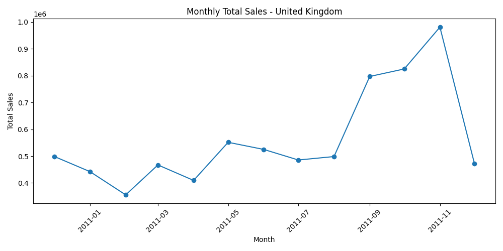

# 🛒 Data Warehousing, OLAP, and Machine Learning Project

This repository contains the full implementation of a university Data Science & Analytics project that integrates:
- **Data Warehousing (Star Schema)**
- **ETL (Extract, Transform, Load)**
- **OLAP Analysis (Roll-up, Drill-down, Slice)**
- **Data Mining Techniques** (Clustering, Classification, Association Rules)

The project uses the **Online Retail dataset** and the **Iris dataset**, with deliverables implemented in a mix of:
- SQL scripts
- Jupyter Notebooks
- Output visualizations & reports

---

## 📂 Project Structure

```
project_root/
├── data/                 # Input datasets (.xlsx, .csv)
├── notebooks/            # Jupyter notebooks for ETL, analysis, ML
├── sql/                  # SQL schema and OLAP queries
├── outputs/
│   ├── db/               # SQLite data warehouse
│   ├── images/           # All output plots and diagrams
│   └── reports/          # CSV summaries, JSON reports, Markdown analysis
└── README.md             # This file
```

---

## 📑 Sections & Tasks

### **Section 1: Data Warehousing & OLAP**

#### Task 1 — **Star Schema Design**
- Deliverables:
  - `schema.sql` — SQL CREATE TABLE script
  - `schema_diagram.png` — Entity-relationship diagram of the data warehouse

**Schema Diagram:**


---

#### Task 2 — **ETL: Online Retail → Data Warehouse**
Implemented in `notebooks/ETL_Retail_Task2.ipynb`:
- **Extract** — Load raw dataset from Excel/CSV
- **Transform** — Clean missing/invalid values, compute `TotalSales`, map categories, add time dimensions
- **Load** — Insert data into SQLite warehouse (`outputs/db/retail_dw.db`)

---

#### Task 3 — **OLAP Analysis**
Implemented in `notebooks/OLAP_Task3_Run_and_Visualize.ipynb`:
- **Roll-up:** Total sales by country and quarter  
  

- **Drill-down:** Monthly sales for United Kingdom  
  

- **Slice:** Sales for Electronics category

The **analysis report** is in [`outputs/reports/olap_analysis.md`](outputs/reports/olap_analysis.md).

---

### **Section 2: Data Mining & Machine Learning**

#### Task 1 — **Iris Dataset Preprocessing**
Implemented in `notebooks/Iris_Preprocessing_Task1.ipynb`:
- Scaling features (MinMaxScaler)
- Encoding labels
- Saving `iris_preprocessed.csv`
- Generating visualizations:

**Scatter Matrix:**  


**Correlation Heatmap:**  


**Boxplots:**  


---

#### Task 2 — **Clustering (K-Means)**
Implemented in `notebooks/Clustering_Iris_Task2.ipynb`:
- K-Means clustering for k = 2, 3, 4
- Adjusted Rand Index (ARI) evaluation
- Elbow curve to select k  
  

- Cluster visualization for k=3  
  

---

#### Task 3 — **Classification & Association Rules**
Implemented in `notebooks/Classification_Apriori_Task3.ipynb`:
- **Classification Models:**
  - Decision Tree (visualized)
  - K-Nearest Neighbors (KNN)
  - Classification report saved as JSON

**Decision Tree Visualization:**  


- **Apriori Association Rules:**
  - Synthetic transaction dataset with injected item associations
  - Top rules saved to JSON

---

## 📊 Project Results Summary

### Section 1
- **OLAP Roll-up:** The UK, Netherlands, and Germany showed the highest quarterly sales totals. Sales trends aligned with seasonal shopping spikes, peaking in Q4.  
- **Drill-down:** The UK monthly trend revealed a sharp increase in November–December, consistent with holiday sales patterns.  
- **Slice:** Electronics sales contributed significantly to revenue, particularly in the holiday season.

### Section 2
- **Clustering:** K=3 gave the best trade-off between simplicity and accuracy (ARI ~0.73). Clusters aligned closely with actual Iris species, though some overlap occurred for `versicolor` and `virginica` due to natural similarities in petal measurements.  
- **Classification:** Decision Tree achieved higher interpretability but slightly lower accuracy compared to KNN. KNN excelled in classification metrics for balanced datasets like Iris.  
- **Apriori Rules:** Discovered strong associations, e.g., "diapers → beer", which can inform product placement and promotions.

---

## 📊 Outputs Overview

- **Databases:** `outputs/db/retail_dw.db`  
- **Images:** `outputs/images/` contains all generated plots and diagrams
- **Reports:** `outputs/reports/` contains:
  - CSV summaries from OLAP queries
  - Classification report JSON
  - Apriori rules JSON
  - OLAP written analysis (Markdown)

---

## ⚙️ How to Run

1. Clone the repository:
   ```bash
   git clone https://github.com/Geoffrey-Chege/DSA2040_Practical_Exam_Geoffrey_Mwangi_566
   cd <your-repo>
   ```

2. Place the raw **Online Retail** dataset into `data/` (named `Online_Retail.xlsx`).

3. Run the ETL pipeline:
   - Open `notebooks/ETL_Retail_Task2.ipynb` in Jupyter/VSCode
   - Run all cells to populate `outputs/db/retail_dw.db`

4. Run OLAP queries:
   - Open `notebooks/OLAP_Task3_Run_and_Visualize.ipynb`
   - Adjust parameters (e.g., `country_of_interest`) as needed

5. Run Section 2 notebooks in order (`Iris_Preprocessing` → `Clustering_Iris` → `Classification_Apriori`).

---

## 📜 License

This project is for **academic purposes** only.  
Dataset credits: UCI Machine Learning Repository (Iris dataset) and UCI/Online Retail dataset.

---
